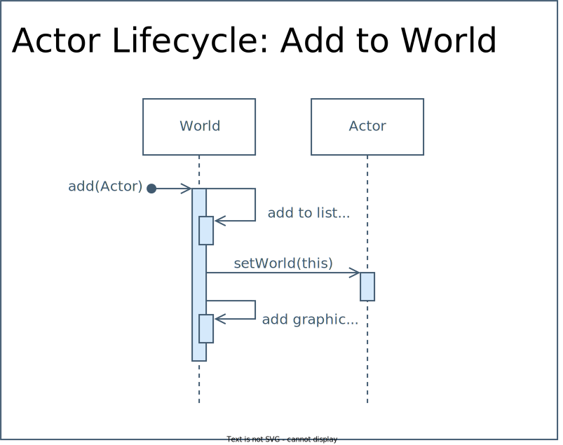

# TEngine

[](https://github.com/tessapower/TEngine/actions/workflows/maven.yml)

My very first 2D game engine to support my very first game, [snek!](https://github.com/tessapower/snek)

`TEngine` (pronounced _"ten-gin"_, short for _"Tessa's Engine"_) developed out of the game engine
supplied by the lecturers of the 159.261 Games Programming course at Massey University. I
fleshed out the original lone little `GameEngine.java` into what you see here, and used it to
build the games that I submitted for course assignments.

`TEngine` was built using Java 17 and uses Java Swing for window management (based on requirement
for the course). The structure of game objects (called `Actor`s) is loosely based on the ECS
model. There is support for actors and actor management, level and world management, audio,
composite primitive containers, transforms, text, animated sprites and sprite sequences, and
basic broad-phase collision detection and collision event notifications.

## Requirements

- Minimum Java SE 17+
- IntelliJ, Eclipse, or your favourite Java editor
- Maven (install locally for command-line-only builds)

## How to Build & Package `TEngine`

This project was developed using the Maven build system. You can either build and package the
project straight from the command line or using your favourite Java IDE that has support for Maven.

When first opening the project, you'll see the project plugins and dependencies being downloaded.
It may take a minute for the project to process and index all the files. You can use the
pre-existing Maven goals to install the project dependencies and package up the `TEngine` into a
`.jar` for use in other projects.

To build from the command-line only, you will need to have Maven installed locally. You can then
use Maven to install the necessary dependencies and package up the `TEngine` into a `.jar` for use
in other projects. Enter the following commands in the project root:

```shell
# install dependencies
mvn install
# package the game engine
mvn package
```

A file called `TEngine.jar` will be created in the `out/artifacts/TEngine_jar/` dir. This `.jar` can
be included in external projects in the usual way you link to external libraries.

## Architecture

`TEngine` is a 2D game engine that makes use of an ECS model to create and coordinate Actors. It
has a graphics engine, and physics engine,

- Actors & Actor Management: Supported ✅
- Audio: Supported ✅
- Graphics Engine: Supported ✅
    - Drawing primitives: circles, rectangles
    - Compound primitive containers
    - Text
    - Sprites
    - Animated Sprites & Sprite Sequences
    - Transforms
- Physics Engine: WIP 🛠️
    - Broad-phase collision detection for AABBs ✅
    - Broad-phase collision detection for Circles
    - Collision detection events ✅
    - Collision events notifications ✅
    - Collision resolution
- World Management: Supported ✅

### Package Diagram


## Working with TEngine

For a practical example of working with `TEngine`, see the `snek!` game [here](https://github.com/tessapower/snek).

- [Creating a Game](#creating-a-game)
- [`World` and `Actor` Management](#world-and-actor-management)
- [`Actor`s and the ECS Model](#actors-and-the-ecs-model)
    - [The `Actor` Class](#the-actor-class)
    - [Components of an `Actor`](#components-of-an-actor)
    - [Creating an `Actor`](#creating-an-actor)
- [`GraphicsEngine`](#graphicsengine)
    - [`TGraphicObject`](#tgraphicobject)
    - [Using `TGraphicCompound` to Compose a Graphic](#using-tgraphiccompound-to-compose-a-graphic)
    - [`Sprite`](#sprite)
    - [`AnimatedSprite`](#animatedsprite)
- [`PhysicsEngine`](#physicsengine)

---

### Creating a Game

To create your own game, first create a new class that extends `GameEngine`, for now we'll refer
to it as `Game`. The `GameEngine` will take care of creating a window, handling mouse and key
events, and running the core game loop for you. Your `Game` class will take care of the game logic,
and being fun! :)

Inside `Game` is where you might decide to coordinate and manage various screens, e.g. a menu,
high score, or game over screen, the state of the game, e.g. playing, paused, game over, etc,
the current level, (called a `World`), and anything else that relates to your game logic.

There are a variety of methods that you can override so your `Game` can set itself up, load levels,
and listen for mouse, key, and collision events. As an example, the structure of your `Game`
class might look like this:


Your `Game` class is the entrypoint for the program, so you will define a `main` like so:

```java
public class Game extends GameEngine {
    private static int FRAMERATE = 60;

    public static void main(String[] args) {
        createGame(new Game(), FRAMERATE);
    }

    public void init() { /* ... */ }

    // ...
}
```

Any custom setup for your game prior to starting can be done by overriding the `init()` method. To
set a custom window dimension and title, call `setWindowProperties(Dimension, String)` from within
`init()`.

---

### `World` and `Actor` Management

Conceptually, a `World` is the same as level in a game. You can create multiple different
`World`s to represent different levels of your game. You can also maintain and manipulate the same
`World` throughout the game by adding and destroying `Actor`s (explained in the next section) and
make changes while the player is playing.


At the beginning of your game, you need to load a `World` into the `GameEngine` by calling
`loadWorld(World)` on your `Game` class. To swap out one `World` for another, first call
`unloadWorld(World)` and then `loadWorld(World)`.

---

### `Actor`s and the ECS model

An _Actor_, a.k.a. _Game Object_, _Game Entity_, or _Node_, is a general purpose object that
interacts with your game, and responds to player input or other Actors in the world. An `Actor`
in `TEngine` is modelled on an _Entity Component System_ (ECS).

In an ECS, an Actor has many individual components to represent its data, characteristics, or
properties. A game engine using an ECS has _systems_ which operate on these components, e.g.
physics, graphics, AI, collisions, etc. The Actor is usually only used to loosely associate the
components to one another via pointers, references, or even simply using an ID.

#### The `Actor` Class

`Actor` is the base class for an object that can be added to a `World`. Anything that the player
can control or interact with in the `World` is considered an `Actor`. This base class has an
initial set of methods and data that you may find useful. There are a few that you should pay
particular attention to:

- `velocity`, `setVelocity()` and `velocity()`: these do what you expect, **without** requiring
  your `Actor` to have a `TPhysicsComponent` to work. This is because you usually want to be able
  to update the position (`origin`) of your `Actor` and all of its components using `setOrigin
  (TPoint)`. By default, `setOrigin(TPoint)` will propagate this change to its graphical and
  physical components, but you can override this method to customize this behavior.

- `setWorld(World)`: Associates this `Actor` with a particular `World`. This can be used to pass
  your `Actor` between `World`s.

> **Warning**
>
> **You do not need to call this method directly**. This method is called by `World` when you
> add an `Actor` to it by calling `myWorld.add(myActor)`.

- `destroyWhenOffScreen(bool)`: set whether this `Actor` should be destroyed when it goes offscreen.
  You can query this setting by calling `destroyWhenOffScreen()`.

- `markPendingDestroy()`: destroy the `Actor` on the next update.

- `destroy()`: removes the graphic from the `World`s graphical canvas, and the `Actor` from the 
  world's list of `Actor`s.

> **Warning**
>
> You only need to mark an `Actor` to be destroyed, and `destroy()` is called automatically by
> `GameEngine` in the update loop.

#### Components of an `Actor`

An `Actor` comprises two components: a graphical representation (`TGraphicObject`), and an
optional physical representation (`TPhysicsComponent`). By default, an `Actor` does not have a
graphical or physical representation. These components must be created and associated with the
`Actor` in the extending class constructor before the `Actor` can be used.

> **Note**
>
> You can choose not to give your `Actor` a physical component if it doesn't make sense for your
> game, but it **must** have a graphical component.

#### Creating an `Actor`

Below is a skeleton class for an `Actor` that represents the player. You may want to keep
small pieces of data in here, such as the number of lives or the player's score. Alternatively
encapsulate this data in a separate `PlayerModel` component and associate that object with this
class.

```java
import tengine.graphics.*;

public class Player extends Actor {
    private final PlayerModel model = new PlayerModel();
    private final Dimension dimension;

    private Player(Dimension dimension) {
        // Initialize any private data members here...
        this.dimension = dimension;

        // Initialize graphic
        graphic = initSprite(dimension);

        // Initialize physics (optional)
        // physicsBody = initPhysics(dimension);

        // ...
    }

    /**
     * Initialize the graphic for this Player. You can use any Graphics class
     * that extends from TGraphicObject, e.g. TRect, AnimatedSprite, or
     * even a TGraphicCompound.
     */
    private TSprite initSprite(Dimension dim) {
        // Initialize the Player's graphic here! You can also choose to 
        // do this step in the constructor if this setup is trivial.
        // ...
    }

    /**
     * Call this method from within your World's update method to update
     * this Player every tick. You don't need to worry about updating the
     * graphic or physicsBody from here, that's handled by the GraphicsEngine
     * and PhysicsEngine!
     */
    public void update() {
        // Update the internal state of the Player here. This could be
        // moving to the next GridSquare, checking for game over conditions,
        // updating the Player's score, etc.
        model.update();
    }

    public boolean hasDied() { return model.numLives() == 0; }

    public boolean handleKeyEvent(KeyEvent keyEvent) { /* ... */ }
    // etc...
}
```

#### Adding an `Actor` to the `World`

Adding `Actor`s to the `World` can be done by using the public methods on the base `World` class:

- `add(Actor)`: adds a single `Actor` to a `World`, and
- `add(Actor...)`: adds a variable number of `Actor`s to a `World`, e.g. `myWorld.add(player,
  opponent, ball, playerGoal, opponentGoal)`

> **Warning**
>
> You **do not** need to call the `setWorld(World)` method on an `Actor`, this is taken care of
> by the `World` itself:
>
> 

#### Destroying an `Actor`

Removing `Actor`s from the `World` can be done by marking the actor to be destroyed with the public
method on the base `Actor` class `markPendingDestroy()`. From there, the `GameEngine` will take
care of removing destroying the `Actor`.

> **Warning**
>
> You **do not** need to call the `remove(Actor)` method on a `World`, this is taken care of by
> the `Actor` itself:
>
> 

---

### `GraphicsEngine`

The `GraphicsEngine` will take care of drawing anything that you add to a `World`. You generally
won't need to interact much with the `GraphicsEngine` or worry about what goes on in here. The
`GameEngine` will take care of retrieving the `Actor` list from your `World` and loading their
graphical components into the `GraphicsEngine`. `Actor`s are drawn in the order that you add them to
the `World`, so you can maintain a pseudo-z ordering by taking advantage of this.

#### `TGraphicObject`

`TGraphicObject` is the base class for all graphical objects that can be displayed in the window.
The basic primitive shapes are `TRect` and `TOval` (which is actually a circle). These 
shapes can be drawn filled or outlined in any valid `java.awt.Color`. There is also support for 
displaying text using `TLabel` and images via the `GraphicsCtx` interface. Using these primitives
and a `TGraphicCompound`, you can already do quite a lot! You may want to create a custom class
that extends from `TShape`, and in that case you can specify how the `GraphicsCtx` draws your 
shape. Override the `draw()` method and make use of the following methods:

- `drawRect(Dimension, Color)`
- `drawFilledRect(Dimension, Color)`
- `drawCircle(Dimension, Color)`
- `drawFilledCircle(Dimension, Color)`
- `drawText(Point, String, Font, Color)`
- `drawImage(Image)`
- `drawImage(Image, Dimension)`

More than likely though, you will use a `Sprite` or `AnimatedSprite` for games. An indepth look 
at these classes can be found below.

Below is an overview of the entire Graphics class hierarchy and the methods for each class:


> **Warning**
> 
> Currently, there is **no** support for getting the actual width or height from a `TLabel`.

All `TGraphicObject`s can have translation, rotation, and scale transforms applied to them. To 
set the translation of an object, use `setOrigin()`. To set the scale, use `setScale(x, y)`, and 
to set the rotation use `setRotation(angleDegrees, rotationOrigin)`. You can specify the origin
(relative to the object's origin) about which a rotation applies; passing in (0, 0) will rotate
the object around its own origin.


#### Using `TGraphicCompound` to compose a graphic

The `TGraphicCompound` is a composite primitive container that lets you group different 
`TGraphicObject`s and treat them as a single object. Following the GoF _Composite Pattern_, a 
`TGraphicCompound` can contain anything that is also a `TGraphicObject`, which includes other 
`TGraphicCompound`s. Each object added to a `TGraphicCompound` will apply its own transforms
_after_ the transforms for the parent container have been applied, meaning that transforms will 
accumulate.

#### `Sprite`

- [ ] TODO: Create and use a `Sprite`

#### `AnimatedSprite`

- [ ] TODO: Create and update an `AnimatedSprite`

---

### `PhysicsEngine`

The `PhysicsEngine` is responsible for collision detection between `Actor`s in your world, creating
`CollisionEvent`s, and notifying the `GameEngine` when two `Actor`s collide via a callback method.
The `GameEngine` sets this callback method to the `onCollision(CollisionEvent)` so your game can
respond to `CollisionEvent`s by overriding this method.

To detect collisions between any two `Actor`s, both `Actor`s need to have physical components
(`TPhysicsComponent`) with collisions active (`hasCollisions`) and a `CollisionShape`.

> **Warning**
>
> Currently, only basic broad phase collision detection between two AABBs is supported. Please
> ensure you use a `CollisionRect` when building up a `TPhysicsComponent`.

To create a `TPhysicsComponent` for your `Actor`, use the `TPhysicsComponentBuilder` class. This
class follows [Bloch's Java Builder pattern](https://blogs.oracle. com/javamagazine/post/exploring-joshua-blochs-builder-design-pattern-in-java),
so works as you would expect:

```java
import tengine.physics.*;

class BouncingBox extends Actor {
    BouncingBox(Dimension dimension) {
        this.dimension = dimension;
        // other initialization...

        physics = initPhysics();
    }

    TPhysicsComponent initPhysics() {
        var boxPhysicsBuilder = new TPhysicsComponentBuilder();
        var collisionRect = new CollisionRect(this.origin, this.dimension);

        boxPhysicsBuilder.actor(this)
                         .isStatic(false)               // Optional: is this Actor stationary? Default = true
                         .collisionShape(collisionRect) // Optional: default = null
                         .hasCollisions(true);          // Optional: default = false

        return boxPhysicsBuilder.build();
    }

    // ...
}
```

For tile-based games or board games, you may find the `GridSquare` class a more useful 
and lightweight concept for collision detection simply by checking if they occupy the position 
in a grid.
